<h1 align="center"><em>Iago Morales proyecto PFC con SAP</em></h1>

<nav>
  <h2>Índice:</h2>
  <ul>
    <li><a href="#descripcion">Descripción del proyecto</a></li>
    <li><a href="#estado-proyecto">Estado del proyecto</a></li>
    <li><a href="#caracteristicas">Características de la aplicación</a></li>
    <li><a href="#acceso-proyecto">Acceso al proyecto</a></li>
    <li><a href="#tecnologias">Tecnologías usadas</a></li>
    <li><a href="#contribuyentes">Personas Contribuyentes</a></li>
    <li><a href="#desarrolladores">Personas Desarrolladoras del Proyecto</a></li>
    <li><a href="#licencia">Licencia</a></li>
  </ul>
</nav>
<h2 id="descripcion">Descripcion del proyecto</h2>
El proyecto consiste en desarrollar dos aplicaciones para poder mejorar la gestión de envíos para una empresa que se
dedica a la venta de kits de muebles. Una para crear los envíos y otra para recibirlos y verlos.

Aquí dejo las características de las aplicaciones:

<b>Aplicación de creación de Envíos:</b> 
Esta aplicación permitirá crear envíos y los paquetes asociados al envio. Podemos configurar los siguientes datos de los envios:

<ul>
  <li>Lugar de origen.</li>
  <li>Lugar de destino.</li>
  <li>Fecha de salida.</li>
  <li>Fecha de llegada.</li>
  <li>ID del conductor asignado al vehículo encargado del transporte (la asignación se realizará exclusivamente a
    conductores
    disponibles).</li>
  <li>Matrícula del vehículo encargado de llevar los paquetes (la asignación se realizará únicamente a vehículos no
    ocupados).</li>
</ul>
<b>Aplicación para recibir los envíos:</b> 
Esta aplicación permite recibir los envíos y permite visualizar los paquetes de los envíos y los muebles de los
paquetes.

Página Principal:
<ul>
  <li> Por defecto, se mostrará una tabla que visualizará los envíos no entregados.</li>
  <li> Se incluirá un botón para acceder a la tabla de envíos entregados.</li>
  <li> Se añadirá un botón que permita visualizar una tabla con los envíos no entregados.</li>
  <li> Se implementará una función de búsqueda que permita buscar los pedidos por su ID.</li>
  <li> Se incluirá un botón para refrescar la tabla.
  <li> Se agregará un botón que permita filtrar los pedidos por fecha de destino y fecha de salida,</li>
    
    <li>Se agregará un boton para ordenar los envios por orden ascendente    o    descendente tanto por fecha de origen como de destino.</li>
  <li> Se incluirá un footer con un botón que abrirá un diálogo para verificar el ID del envío.</li>
</ul>

Página de Detalles del Envío:
<ul>
<li>Esta página se abrirá al hacer clic en un envío específico.</li>
<li>Permitirá visualizar los detalles del envío, así como los paquetes asignados al mismo.</li>
</ul>

Página de Detalles del Mueble:
<ul>
<li>Esta página se accede al hacer clic en un tipo de mueble en particular.</li>
<li>Proporcionará la visualización de los datos detallados de los muebles.</li>
</ul>

<h2 id="estado-proyecto">Estado del proyecto</h2>

  

  

<h2 id="caracteristicas">Caracteristicas de la aplicaicon</h2>

Voy a proceder a mostrar las funcionalidades mas importantes tanto de la aplicacion para crrear envios como la aplicacion para recibir los envios

<b font-size="20px">Aplicacion crear envios</b>

Nada mas arrancar la aplicacion nos saldra todas las opciones para poder crear el envio

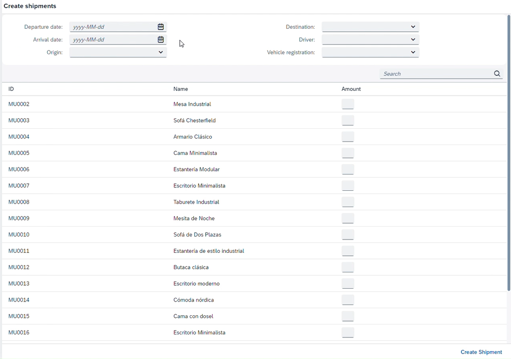
<ul>
<li>Fecha de origen</li>
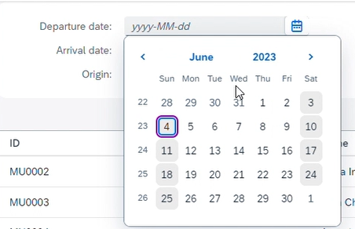

<li>Fecha de destino</li>
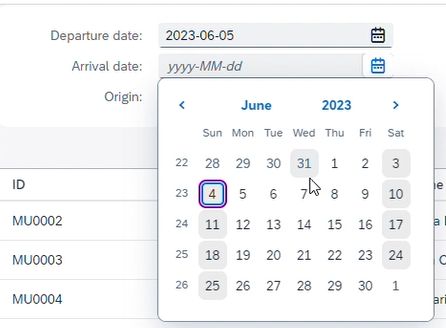

<li>Lugar de origen </li>
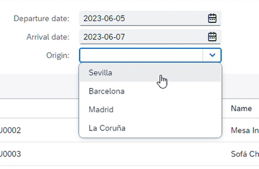

<li>Lugar de destino</li>
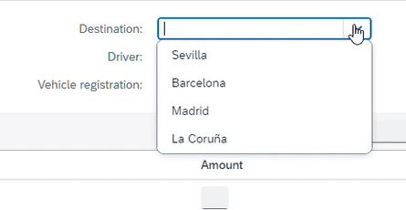

<li>Conductor (Solo nos saldrán los conductores que no estén ocupados )</li>
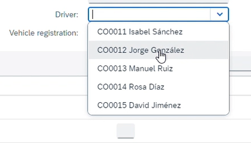

<li>Vehiculos (Solo nos saldra los vehículos que no estén ocupados )</li>
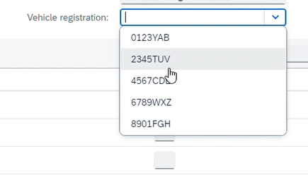

</ul>

Si queremos añadir un mueble para crear un paquete asociado al envío solo tenemos que indicar una cantidad al mueble.

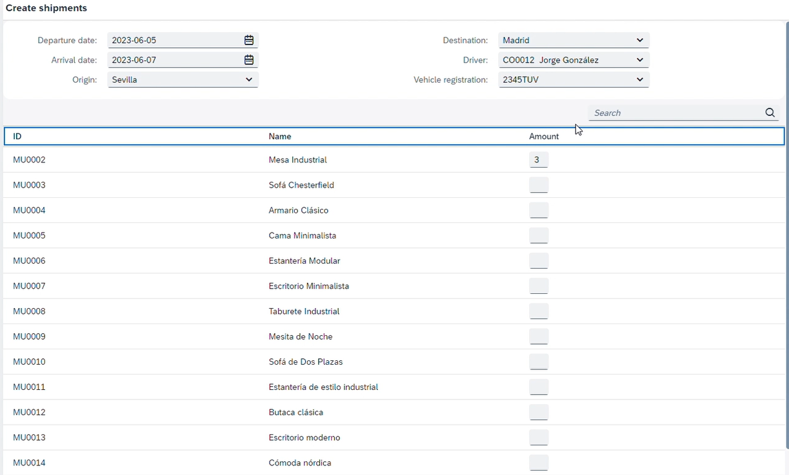

<b>Aplicacion para recibir envios</b>
<ul>
  <li>Al acceder a la página, se mostrarán de forma predeterminada los envíos que aún no han sido entregados.</li>
  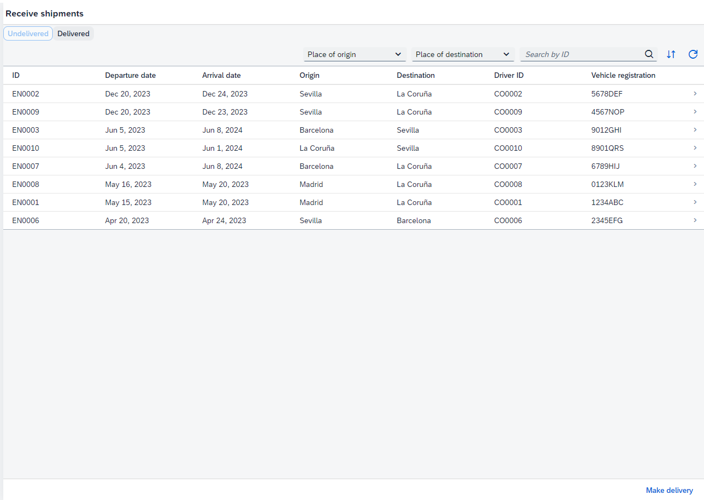

  <li>En la esquina superior derecha, se encontrará un botón que permite visualizar los envíos que ya han sido entregados.</li>
  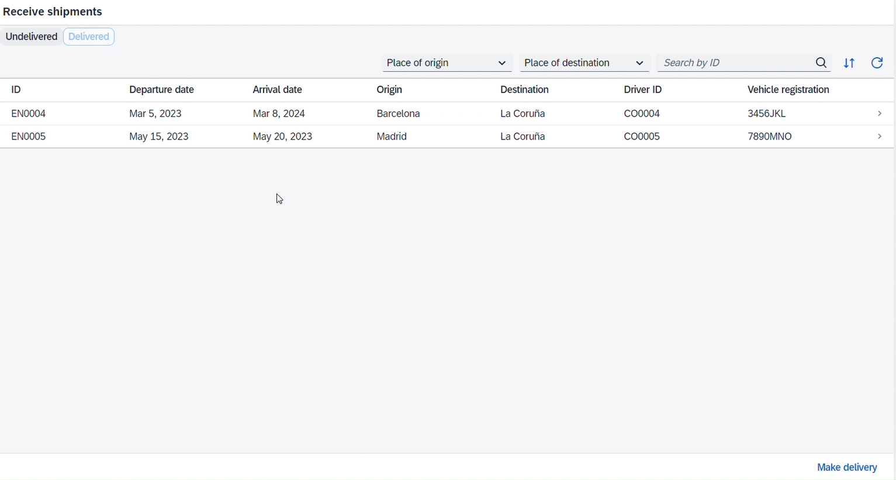

  <li>Tanto en la lista de envíos entregados como en la de envíos no entregados, se ofrece la opción de filtrar los envíos según su origen, destino y ID. Es importante destacar que, por ejemplo, si se encuentra en la página de envíos no entregados, solo se mostrarán los envíos que se encuentran en ese estado, y viceversa.</li>
  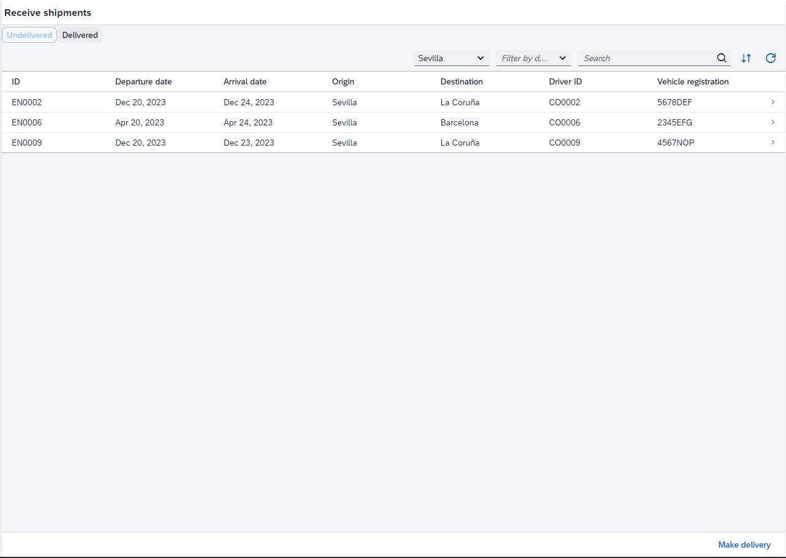
  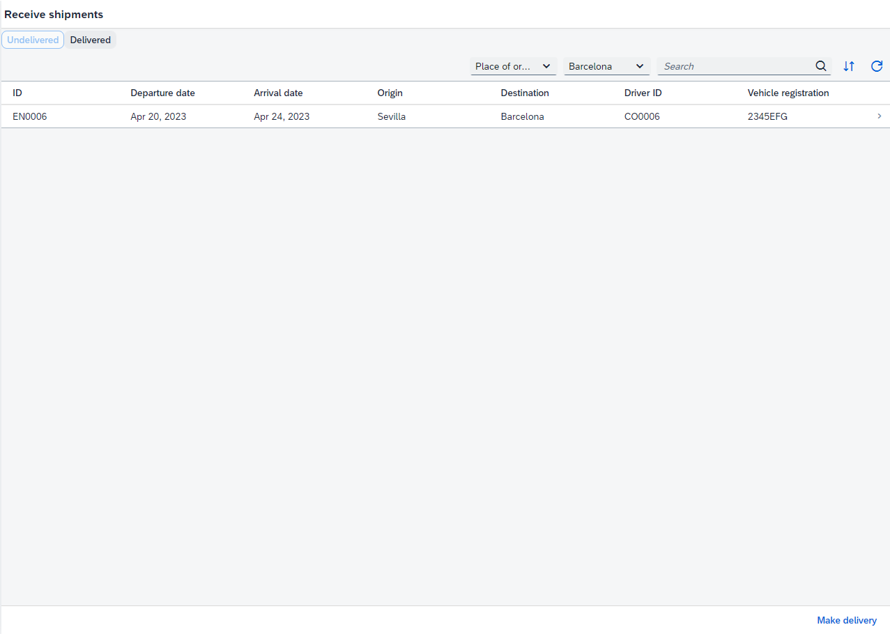
  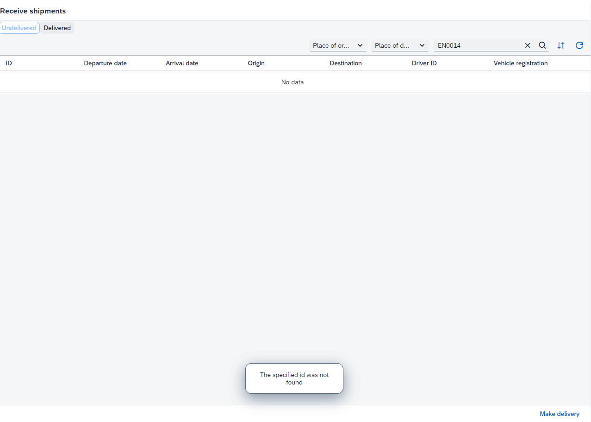

  
  <li>Se ofrece la posibilidad de ordenar los envíos en forma ascendente o descendente según su fecha de origen o fecha de destino.</li>
  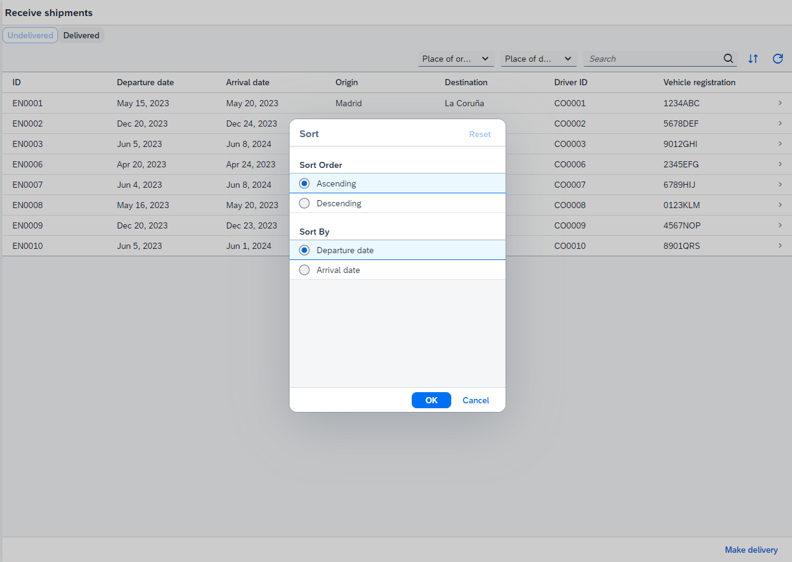
  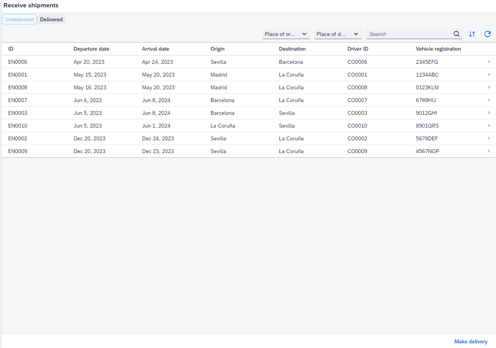

  <li>Para ver los paquetes asociados a un envío en particular, basta con hacer clic en dicho envío.</li>
  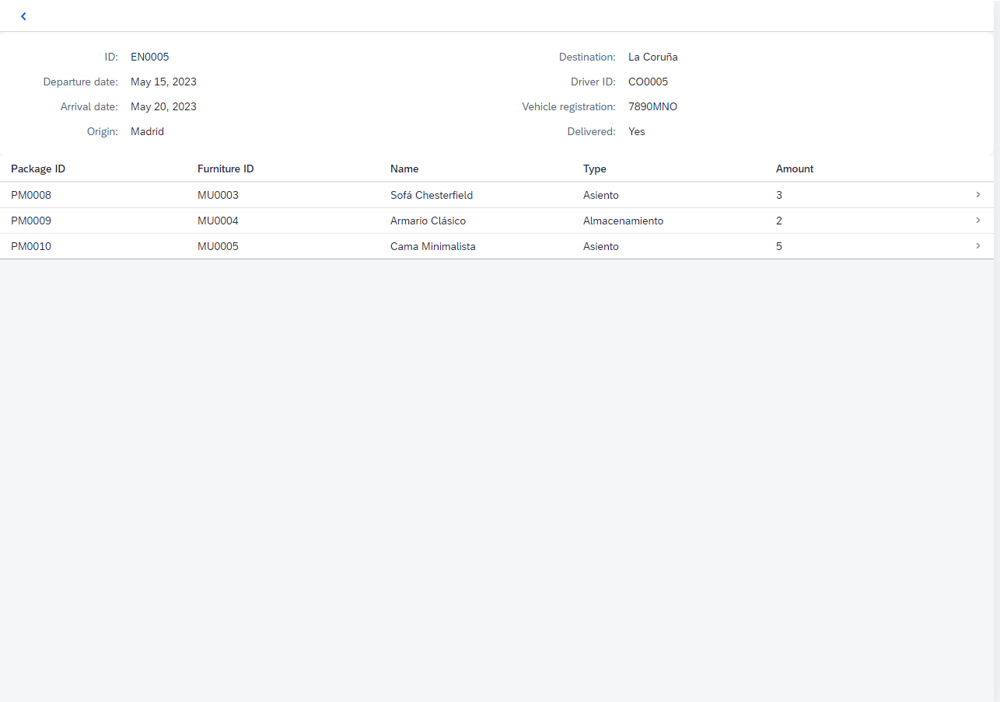

  <li>De manera similar, si se desea visualizar el mueble asociado a un paquete, simplemente se debe hacer clic en el paquete correspondiente.</li>
  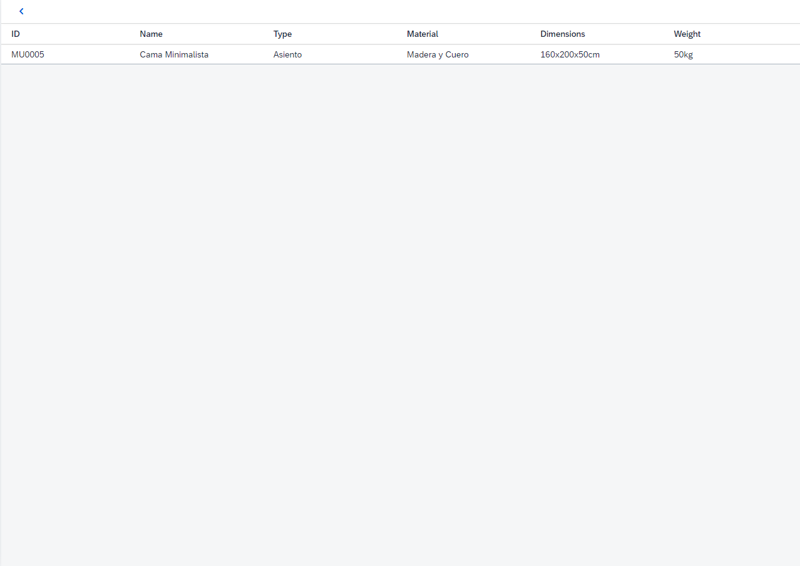

</ul>
<h2 id="acceso-proyecto">Acceso al proyecto</h2>

Para poder acceder a mi proyecto, podéis clicar en el siguiente enlace a mi repositorio en github <a href="https://github.com/IagoMC/IagoMC_PFC">Repositorio</a>

Para poder iniciar y ejecutar el proyecto, primero debes crear una cuenta gratuita en SAP BTP. A continuación, proporciono un tutorial elaborado por los profesionales de SAP que te guiará en el proceso de creación de una cuenta gratuita: <a href="https://groups.community.sap.com/t5/sap-learning-blog-posts/sap-btp-free-tier-create-your-individual-account/ba-p/1321">SAP BTP Free Tier: Create Your Individual Account</a>.

Una vez hayas completado el registro y configuración según lo indicado en el tutorial, procedemos a crear nuestro devSpace de la siguiente manera:

<ol>
  <li>Inicia sesión en SAP BTP y accede a tu cuenta.</li>
  <li>Navega hasta la sección de devSpaces y crea un nuevo devSpace. con la siguiente condiguracion: </li>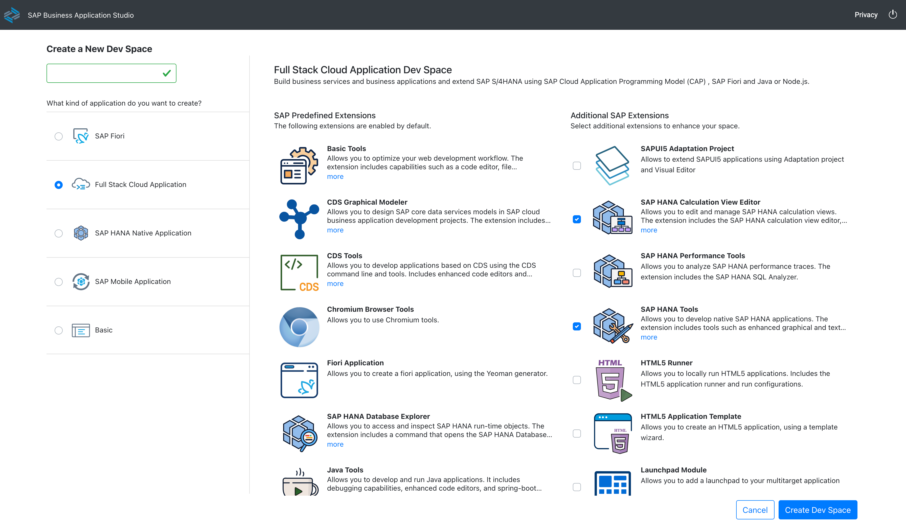
  <li>Una vez configurado el devSpace, accede a él y navega hasta la carpeta "projects".</li>
  <li>Clona el repositorio utilizando el siguiente comando:</li>
</ol>

<pre><code>git clone https://github.com/IagoMC/IagoMC_PFC.git</code></pre>

Después de clonar el repositorio, ejecuta el comando "npm install" para asegurarte de que todas las dependencias se instalen correctamente.

Es importante tener en cuenta que el servicio oData está asociado a mi cuenta personal, lo que significa que si el servicio está activo, ambas aplicaciones funcionarán correctamente. Dado que el servicio oData está vinculado a mi cuenta, puede que necesites realizar las configuraciones necesarias para que el servicio funcione correctamente en tu cuenta.

Si tienes alguna pregunta o necesitas más ayuda durante el proceso de configurac
  

<h2 id="tecnologias">Tecnologias usadas</h2>
<ul>
  <li><b>SAP</b> es una tecnología empresarial desarrollada por la empresa alemana SAP SE. Proporciona soluciones
    informáticas modulares y escalables que ayudan a las organizaciones a gestionar y optimizar sus operaciones
    empresariales en áreas como finanzas, recursos humanos y cadena de suministro.</li>
  

  <li><b>SAP BTP</b>(Business Technology Platform): Plataforma empresarial integral que ofrece servicios y herramientas
    para desarrollar, integrar y extender aplicaciones empresariales de SAP en la nube. Incluye capacidades de
    desarrollo, integración, gestión de datos, análisis y seguridad.</li>
  

  <li><b>SAP BAS</b>(Business Application Studio): Entorno de desarrollo en la nube que permite a los desarrolladores
    crear y extender aplicaciones empresariales utilizando diferentes tecnologías de SAP. Proporciona herramientas y
    servicios para el ciclo de vida completo de las aplicaciones, desde el desarrollo hasta la implementación y
    administración</li>
  

  <li><b>SAP HANA Database Explore</b>Herramienta para explorar y analizar datos almacenados en la base de datos SAP
    HANA. Ofrece una interfaz gráfica intuitiva para consultar, visualizar y analizar datos en tiempo real, así como
    para crear informes interactivos </li>
  

  <li><b>SAP HANA Cloud Central</b>: Consola de administración centralizada para gestionar y monitorizar las instancias
    de SAP HANA en la nube. Permite la configuración, supervisión del rendimiento, aplicación de actualizaciones y
    gestión de la seguridad de las bases de datos SAP HANA en entornos en la nube.</li>
  

  <li><b>SAP Fiori</b>: Una plataforma de diseño y pautas de experiencia de usuario para desarrollar aplicaciones
    empresariales intuitivas y centradas en el usuario. Ofrece aplicaciones preconstruidas y plantillas que siguen
    principios de diseño modernos, proporcionando una experiencia de usuario coherente y optimizada en dispositivos
    móviles y de escritorio.</li>
  

  <li><b>SAP HANA</b>: Plataforma de base de datos y computación en memoria desarrollada por SAP. Permite el
    procesamiento rápido de grandes volúmenes de datos en tiempo real, utilizando tecnología de almacenamiento en
    memoria y ofreciendo capacidades para análisis empresarial, procesamiento de transacciones en tiempo real y
    planificación, entre otros.</li>
  

  <li><b>oData</b>: Protocolo web utilizado por SAP HANA para exponer sus datos y servicios a través de interfaces web.
    Permite el acceso y la manipulación de datos utilizando protocolos y formatos estándar ampliamente adoptados,
    facilitando la integración e interoperabilidad entre diferentes sistemas.</li>

</ul>

<h2 id="contribuyentes">Personas Contribuyentes</h2>
<b>Iago Morales Camacho</b>
<h2 id="desarrolladores">Personas Desarrolladoras del Proyecto</h2>
<b>Iago Morales Camacho</b>

<h2 id="licencia">Licencia</h2>

Licencia de software privativo. Su uso, redistribución o modificación está prohibida, o requiere que se solicite autorización.

